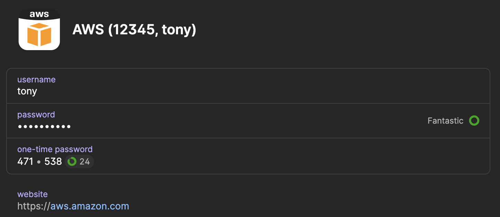

# Awsume 1Password Plugin

_Awsume 4+ only_.

This is a plugin that automates the entry of MFA tokens using 1Password.
It replaces AWSume's `MFA Token:` prompt with a biometric unlock and delegates to 1Password for policies on how often unlock is required.
In other words: it saves you from ever having to type an MFA token, ever again!

## Installation

### Install This Plugin

```
pip3 install awsume-1password-plugin
```

If you've installed awsume with `pipx`, this will install the console plugin in awsume's virtual environment:

```
pipx inject awsume awsume-1password-plugin
```

### Set Up 1Password

1. Install the [1Password CLI](https://developer.1password.com/docs/cli)
2. Enable [biometric unlock](https://developer.1password.com/docs/cli/about-biometric-unlock) of the CLI in 1Password settings

### Configure AWSume

This plugin needs to know which 1Password vault item to use for each MFA token.
You can specify this information in a new subsection of `~/.awsume/config.yaml` called `1password`. This subsection is a YAML map where
each key is an AWS MFA token ARN, and the corresponding value is the name of a 1Password item that stores the corresponding secret and can generate MFA tokens.

An example configuration file:

```yaml
colors: true
fuzzy-match: false
1password:
  "arn:aws:iam::12345:mfa/tony": "AWS (12345, tony)"
```

In this example, when I assume roles via my AWS account 12345, I use an MFA token associated with the IAM user `tony` that I have configured in the [AWS Console](https://us-east-1.console.aws.amazon.com/iamv2/home).
I have a corresponding 1Password named "AWS (12345, tony)"
that looks like this:



## Usage

This plugin works automatically in the background; just `awsume` roles as you normally would, and it will invoke the `op` command to obtain TOTP tokens whenever AWSume requires one.
